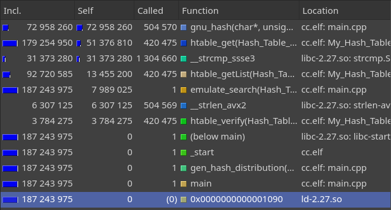
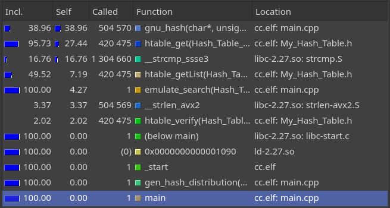
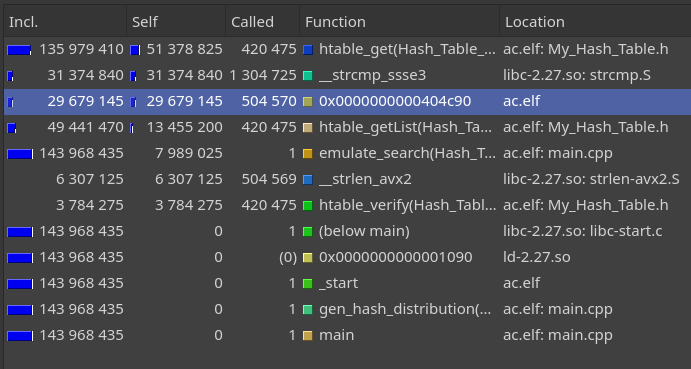
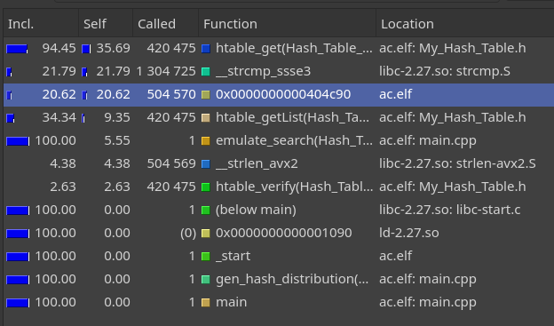
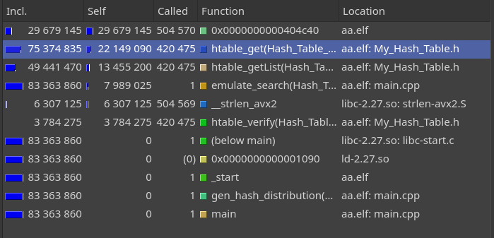
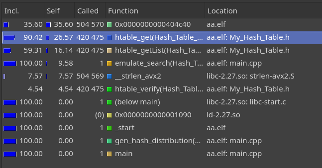

# Отчет об оптимизации хэш-таблицы.
В данной работе с помощью программ профайлеров искалось
"бутылочное горлышко" в хэш-таблице, написанной на **C**.
Наиболее медленные места затем переписывались на ассемблере,
после чего профилирование проводилось еще раз и фиксировалось ускорение.  
Для профилирования использовался `valgrind` с плагином `callgrind`.
Для просмотра отчетов `callgrind` использовался `kcachegrind`.
Компиляция происходила с уровнем оптимизации `-O0`  
## Методика измерения
Для симуляции типичного поведения хеш-таблицы измерения будем проводить не по всей программе.
Инициализация таблицы проводиться без профилирования. После этого будем искать каждое слово из
таблицы по 5 раз. Так как размер исходной выборки примерно 80 тысяч слов,
получим примерно 400 тысяч запросов к хэш-таблице.
Размер таблицы возьмем равным *20000*.
```C++
void emulate_search(Hash_Table_t* table, char* buffer, size_t size)
{
    char* ptr = buffer;
    while (ptr < buffer + size - 1)
    {
        char word[MAX_WORD_LEN] = {};
        int step = 0;
        sscanf(ptr, "%s%n", word, &step);
        ptr += step;
        bool valid = true;
        for (size_t i = 0; i < 5; i++)      // on every put 5 searches performs
        {
            CALLGRIND_TOGGLE_COLLECT;       // profiling on
            htable_get(table, word, &valid);
            CALLGRIND_TOGGLE_COLLECT;       //profiling off
        }
    }
}
```
Опции профилировщика: `valgrind --tool=callgrind --collect-atstart=no <programm>`  

## Оптимизация первая.

Проведем измерения для нашей хэш-таблицы. Получим следующую картину распределения времени:  

> Абсолютное время работы функции в тактах.  


> Относительное время работы.  

Как видно, наиболее дорогой функцией оказалось вычисление хэша. Вот ее код:  
```C++
unsigned int gnu_hash(char* data, size_t size)
{
    unsigned int h = 5381;

    for (int i = 0; i < size; i++)
    {
        h = (h << 5) + h + name[i];
    }

    return h;
}
```

Для ускорения перепишем эту функцию на ассемблере, выделив ее в отдельный файл.
В исходном файле останется прототип функиии.
`С++ extern "C" unsigned int gnu_hash(char* data, size_t size);`

Саму функцию опишем в отдельном файле и прилинкуем к проекту во время сборки.
```
;rdi = char* data
;rsi = size_t size

section .text

global gnu_hash

gnu_hash:       mov eax, 5381
                mov rcx, rsi

.Next:          mov esi, eax
                shl esi, 5
                add rax, rsi
                xor rsi, rsi
                mov sil, byte [rdi]
                add eax, esi
                inc rdi
                loop .Next
                ret
```
Повторим измерения еще раз.

> Абсолютное время работы функции в тактах.  


> Относительное время работы.  

Название функции перестало отображаться, но ее все еще можно найти по количеству вызовов (она выделена на сриншоте).
Как можно видеть, если до этого взятие хэша занимало около 73 миллионов инструкций,
то после оптимизации занимает около 29,5 миллионов. Таким образом функция ускорилась
в **2.5** раза.  

## Оптимизация вторая.

Теперь двумя самыми медленными местами стали функции перебора и сравнения строк в таблице.
Этот участок кода можно было бы сильно ускорить путем увеличения размера хэш-таблицы, но цель работы в применении ассемблера.
В коде эти два места находятся рядом, поэтому можно будет одной вставкой оптимизировать сразу две медленные части:  
```C++
value_t htable_get(Hash_Table_t *table, my_key_t key, bool* valid /*= nullptr*/)
{
    htable_verify(table, VERIFY_CONTEXT);
    List_t* list = htable_getList(table, key);
    for (int i = list->head; i != 0; i = list->data[i].next)
    {
        if (strcmp((char*)list->data[i].value.key, (char*)key) == 0)
        {
            if (valid != nullptr)
            {
                *valid = true;
            }
            return list->data[i].value.value;
        }
    }

    if (valid != nullptr)
    {
        *valid = false;
    }
    htable_verify(table, VERIFY_CONTEXT);
    return value_POISON;
}
```
В этот раз воспользуемся ассемблерной вставкой.
```C++
value_t htable_get(Hash_Table_t *table, my_key_t key, bool* valid /*= nullptr*/) {
    htable_verify(table, VERIFY_CONTEXT);
    List_t* list = htable_getList(table, key);
    value_t ret_val = nullptr;
    bool found = false;
    __asm__(".intel_syntax noprefix\n\t"
        "cld\n\t"
        "mov r8, rax\n\t"
        "mov rbx, [rdx + 8]\n\t"
        "xor rcx, rcx\n\t"
        "mov ecx, dword ptr [rdx+20]\n\t"
        ".Next:\n\t"
        "mov rsi, r8\n\t"
        "mov rax, 3\n\t"
        "mul rcx\n\t"
        "mov rcx, rax\n\t"
        "mov rdi, [rbx + 8 * rcx]\n\t"
        ".CmpNext:\n\t"
        "rep cmpsb\n\t"
        "jne .False\n\t"
        "cmp qword ptr [rdi], 0\n\t"
        "jne .CmpNext\n\t"
        "mov rdx, 1\n\t"
        "mov rax, [rbx + 8 * rcx + 8]\n\t"
        "jmp .Return\n\t"
        ".False:\n\t"
        "mov ecx, dword ptr [rbx + 8 * rcx + 20]\n\t"
        "cmp ecx, 0\n\t"
        "jne .Next\n\t"
        "xor rdx, rdx\n\t"
        ".Return:\n\t"
        ".att_syntax prefix"
        : "=a"(ret_val), "=d"(found)
        : "a"(key), "d"(list)
        : "rcx", "rbx", "rdi", "rsi", "r8");
    if (valid != nullptr)
    {
        *valid = found;
    }
    return ret_val;
}
```
Проведем измерения еще раз.  

> Абсолютное время работы функции в тактах.


> Относительное время работы.

До оптимизации функция сравнения и прохода по массиву занимала суммарно 82 миллиона инструкций.
Теперь же суммарное время работы сократилось до 22 миллионов. Время работы функции
уменьшилось в **4** раза.

## Итоги

Изначально изучаемый участок программы занимал 187 243 975 инструкций. После оптимизации
этот же участок стал занимать 83 363 860 инструкций. Таким образом *36* строчек ассемблера
ускорили программу в **2,25** раз.
